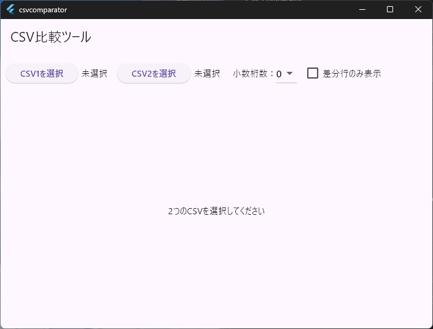

# CSV Comparator (Flutter)

CSV Comparatorは、2つのCSVファイルを読み込み、差分を比較・表示するFlutterアプリケーションです。  
シンプルなUIで、行単位の比較結果を視覚的に確認できます。

## 🚀 特徴

- 2つのCSVファイルを選択して比較
- 行ごとの差分をハイライト表示
- ファイルの内容をテーブル形式で表示
- Flutter製のクロスプラットフォーム対応（Windows / macOS / Linux / Web）

## 📸 スクリーンショット

## 🛠 機能詳細

- CSVファイル読み込み
- 差分検出（追加・削除・変更）
- 表示行の選択
- Web対応（`flutter build web`）

# Requirement

* flutter
* file_picker: ^6.0.0
* csv: ^6.0.0

# Author

potetofly25 - 2025
